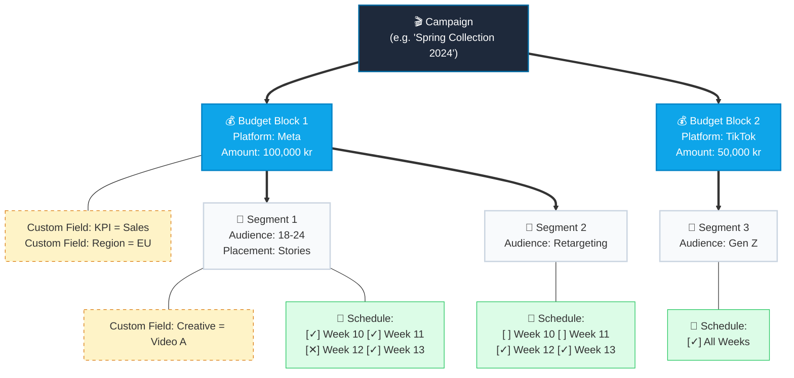

```

```
# Proposal: Media Plan Feature for ellaella.io

## Overview
We propose to introduce a dedicated **Media Plan** module within each Content Plan. This feature will allow agencies and their clients to map out budgets, objectives, and weekly schedules dynamically.

Currently, media planning is often handled in large, complex spreadsheets. While spreadsheets are flexible, they do not translate well into a seamless, accessible Web / Mobile application experience.

Instead of migrating a massive grid into the app (which causes poor readability, scrolling issues, and performance overhead), we propose a modern, hierarchical **"Block & Card" interface**.

## Why We Advise Against a "Spreadsheet Table" UI
1.  **Mobile Unfriendly:** A table with 60+ columns (including 52 weeks) breaks entirely on small screens or laptops.
2.  **Structural Rigidity:** In a spreadsheet, adding a custom field (like "KPI" for one platform but not another) means adding a column for the entire sheet, creating empty, confusing space.
3.  **Visual Overload:** Users are presented with a wall of data. A card-based system uses progressive disclosure—showing only what is needed, when it is needed.

---

## 🏗 The "Pyramid" Solution

We propose structuring the Media Plan hierarchically. This gives the client infinite flexibility to add custom fields without breaking the design.

1.  **Campaign (Top Level):** The overall container (e.g., "Q1 Marketing 2024").
2.  **Budget Block (Mid Level):** E.g., "Meta - 100,000 kr". Users can attach custom fields specifically to this budget.
3.  **Segment (Bottom Level):** E.g., "Audience 1". Contains specific placements and the 52-week timeline.

### Conceptual Structure



---

## 💻 Design Concept

Based on this architecture, we have created an HTML/CSS Prototype using the existing **Glassmorphism B2B Software** design system of ellaella.io.

### Key Features of the Design:
*   **Sticky Campaign Navigation:** Easily jump between campaigns while keeping the "Total Budget" constantly visible.
*   **Clean Budget Cards:** Each platform budget is separated into its own clean card, making it extremely readable and scannable.
*   **Custom Fields as "Chips":** Instead of empty table columns, custom data like *KPIs* or *Periods* are displayed as neat chips next to the budget.
*   **Horizontal Timeline Scroll:** The 52-week schedule is presented as a scrollable timeline within each segment. It keeps the familiarity of the "spreadsheet blocks" while fitting beautifully on any screen size.

### Prototype Screenshot


This approach provides the exact same data capability as the current spreadsheet, but wrapped in a premium, flexible SaaS interface.
