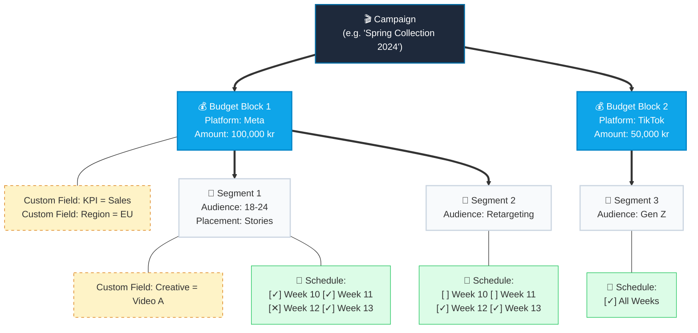

# Media Plan Feature: Hierarchical Structure Proposal

## Overview
Based on your idea, we can replace the complex spreadsheet format with a user-friendly "Pyramid" (Hierarchical) structure. This approach is much better suited for a modern web application (like FlutterFlow) than a giant grid, as it provides a cleaner UI, better performance, and high flexibility.

Instead of a single massive table, the user will interact with nested "cards" or "blocks" that represent the natural hierarchy of a media plan.

## The "Pyramid" Concept

The hierarchy is structured in three main levels:

1.  **Campaign (Top Level)**
    *   Acts as the main container for the media plan.
    *   Connected to the Content Plan.
2.  **Budget Block (Mid Level)**
    *   A campaign can have multiple Budget blocks.
    *   Contains its own set of standard fields.
    *   **Flexibility:** Allows adding an infinite number of **Custom Fields** (key-value pairs) specific to this budget.
3.  **Segment Block (Bottom Level)**
    *   A budget can have one or multiple Segments.
    *   Contains its own standard fields (e.g., audience, placements).
    *   **Flexibility:** Allows adding **Custom Fields**.
    *   **Weekly Schedule:** Contains the timeline (e.g., Week 1 to Week 52) indicating when this specific segment is active.

---

## Visual Concept Diagram

Here is a diagram you can show the client to explain how the data is structured and how the UI will conceptually look:

---

## Proposed Database Structure (Firebase Firestore)

To support this in FlutterFlow and Firebase, we will use Firestore **Subcollections**. This ensures data is loaded securely and efficiently.

### 1. `campaigns` (Existing subcollection of `content_plans`)
*   `name`: string
*   ... (existing fields)

### 2. `media_plan_budgets` (New subcollection inside `campaigns`)
*   **Path:** `content_plans/{planId}/campaigns/{campaignId}/media_plan_budgets/{budgetId}`
*   `platform`: string (e.g., "Meta")
*   `amount`: number (The budget sum)
*   `comments`: string
*   `custom_fields`: Array of Objects (Struct: `FieldStruct`)
    *   `[ { "key": "Main KPI", "value": "LINK CLICKS" }, ... ]`
*   `created_at`: timestamp

### 3. `media_plan_segments` (New subcollection inside `media_plan_budgets`)
*   **Path:** `.../media_plan_budgets/{budgetId}/media_plan_segments/{segmentId}`
*   `name`: string (e.g., "Audience 1 + Look a like")
*   `placements`: string (or array of strings)
*   `custom_fields`: Array of Objects (Struct: `FieldStruct`)
    *   `[ { "key": "Ad Set", "value": "Awareness" }, ... ]`
*   `active_weeks`: Array of Integers (e.g., `[1, 2, 3, 4]`) representing which weeks of the year this segment is active.
*   `is_live`: boolean
*   `created_at`: timestamp

---

## Why this approach is excellent for the client:

1. **Clean UI vs. Tabular Mess:** In a web app, a massive Google Sheet is hard to read on smaller screens. This "card/block" structure allows us to build a beautiful, responsive UI where Budgets can be expanded/collapsed.
2. **Infinite Flexibility:** By using a `custom_fields` array (a List of Data Types in FlutterFlow), the admin can add rows like "Main KPI", "Objective", or anything else without needing a developer to add new columns to the database.
3. **Automated Budget Calculation:** Because Budgets are separate entities with an `amount` field, FlutterFlow can easily sum them up to show the "Total Campaign Budget" at the bottom of the page.
4. **Isolated Schedules:** Each Segment has an `active_weeks` array. In the UI, we can render 52 small clickable boxes for the timeline. If the array contains `[12]`, box 12 is highlighted green. Very easy to implement in FlutterFlow.
